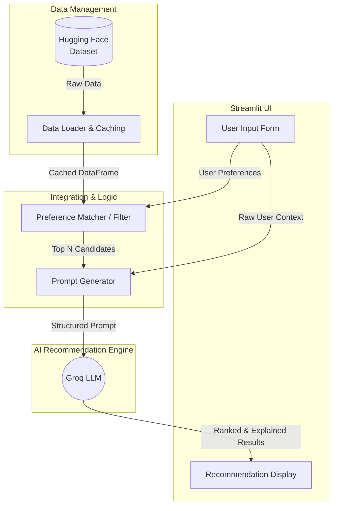

# Architecture Document: AI-Powered Restaurant Recommendation System

This document outlines the high-level architecture and system design for the AI-Powered Restaurant Recommendation System based on the Zomato use case.

## 1. System Overview

The system is a monolithic web application designed to intake user preferences, filter a real-world dataset of restaurants, and leverage a Large Language Model (LLM) to generate personalized, human-readable recommendations. 

## 2. Technology Stack

- **Frontend & App Framework**: [Streamlit](https://streamlit.io/) (Python)
  - Selected for its rapid prototyping capabilities and excellent support for data-driven applications.
- **Data Ingestion & Processing**: 
  - `datasets` (Hugging Face) for fetching the raw data.
  - `pandas` for in-memory data manipulation, filtering, and structuring.
- **LLM Integration**: Groq API
  - Used for its strong reasoning capabilities and fast inference to analyze filtered restaurants and match them against implicit/explicit user preferences.

## 3. High-Level Architecture Diagram

## 4. Component Details

### 4.1. Data Ingestion & Caching (`data_loader.py` or internal component)
- **Responsibility**: Fetch the `ManikaSaini/zomato-restaurant-recommendation` dataset.
- **Process**: Load the dataset, convert it into a Pandas DataFrame, and apply any necessary preprocessing (e.g., standardizing cost, handling missing values, extracting cuisines into lists).
- **Optimization**: Utilize Streamlit's `@st.cache_data` to ensure the dataset is only downloaded and processed once per session, minimizing load times.

### 4.2. User Input & UI (`app.py`)
- **Responsibility**: Collect user preferences securely and intuitively.
- **Fields**:
  - `Location`: Dropdown populated dynamically from the dataset's unique locations.
  - `Budget`: Select box (Low, Medium, High).
  - `Cuisines`: Multiselect box.
  - `Minimum Rating`: Slider (1.0 to 5.0).
  - `Additional Preferences`: Free-text area (e.g., "Good for dates, quiet ambiance").
  - `API Key`: Secure password input for the Groq API key.

### 4.3. Integration & Filtering Layer (`recommender.py`)
- **Responsibility**: Narrow down the dataset from thousands of rows to a small subset (e.g., top 10-20) that strictly meet the user's hard constraints (Location, Min Rating, Budget).
- **Process**:
  1. Apply Pandas boolean indexing based on UI inputs.
  2. Sort the remaining restaurants by Rating or Popularity.
  3. Extract the top *N* candidates into a JSON or Markdown format suitable for LLM consumption.

### 4.4. Prompt Engineering & LLM Engine (`llm_engine.py`)
- **Responsibility**: Generate final personalized recommendations.
- **Process**:
  1. Construct a prompt injecting:
     - The user's explicit preferences and free-text context.
     - The structured list of candidate restaurants.
  2. Instruct the LLM to act as an expert food critic/concierge.
  3. Ask the LLM to select the top 3-5 restaurants from the provided list and generate a short, personalized paragraph explaining *why* it fits the user's needs.
  4. Enforce structured output (e.g., JSON response) from the LLM to ensure the UI can parse and display the results cleanly.

### 4.5. Output Display (`app.py`)
- **Responsibility**: Present the results to the user.
- **Process**: Parse the structured LLM response and render visually appealing cards containing the Restaurant Name, Rating, Cost, Cuisines, and the personalized AI explanation.
