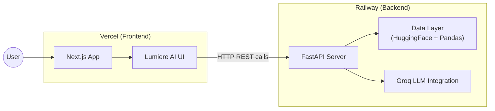

# Deployment Plan: Backend (Railway) + Frontend (Vercel)

## Overview

This plan splits the current Streamlit monolith (`app.py`) into two independently deployable services:

| Component | Tech Stack | Platform | URL Pattern |
|---|---|---|---|
| **Backend API** | Python + FastAPI | Railway | `https://zomato-api-*.up.railway.app` |
| **Frontend** | Next.js (React) | Vercel | `https://zomato-recommender.vercel.app` |

The existing `code.html` Lumiere AI design will serve as the visual blueprint for the Next.js frontend.

---

## Architecture After Split



---

## Phase 1: Project Restructuring

Reorganize the monorepo into two directories:

```
Zomato Project/
├── backend/                    # → Deploys to Railway
│   ├── app/
│   │   ├── __init__.py
│   │   ├── main.py             # FastAPI entry point
│   │   ├── data_loader.py      # HuggingFace dataset loading + caching
│   │   ├── recommender.py      # Filtering + LLM logic
│   │   └── models.py           # Pydantic request/response schemas
│   ├── requirements.txt
│   ├── Procfile                # Railway process file
│   ├── railway.toml            # Railway config
│   └── .env                    # (gitignored) GROQ_API_KEY
│
├── frontend/                   # → Deploys to Vercel
│   ├── src/
│   │   ├── app/
│   │   │   ├── layout.tsx
│   │   │   ├── page.tsx        # Main recommendation page
│   │   │   └── globals.css     # Lumiere AI design system
│   │   ├── components/
│   │   │   ├── Sidebar.tsx
│   │   │   ├── PreferenceForm.tsx
│   │   │   ├── RecommendationCard.tsx
│   │   │   └── QuickCompare.tsx
│   │   └── lib/
│   │       └── api.ts          # Backend API client
│   ├── package.json
│   ├── next.config.js
│   ├── tailwind.config.ts
│   └── .env.local              # NEXT_PUBLIC_API_URL
│
├── architecture.md
├── DESIGN.md
├── deployment-plan.md          # ← This file
└── .gitignore
```

---

## Phase 2: Backend — FastAPI on Railway

### 2.1 API Endpoints

Extract the logic from `app.py` into these REST endpoints:

| Method | Endpoint | Purpose |
|---|---|---|
| `GET` | `/api/health` | Health check (Railway uses this) |
| `GET` | `/api/filters` | Returns available locations, cuisines, max rating (populates dropdowns) |
| `POST` | `/api/recommend` | Accepts preferences → filters data → calls Groq → returns recommendations |

### 2.2 Request/Response Schemas

**`POST /api/recommend` — Request Body:**
```json
{
  "location": "Banashankari",
  "budget": "Medium",
  "min_rating": 3.5,
  "cuisines": ["North Indian", "Chinese"],
  "additional_preferences": "romantic ambiance, rooftop"
}
```

**`POST /api/recommend` — Response:**
```json
{
  "total_matches": 42,
  "candidates_analyzed": 5,
  "recommendations": [
    {
      "name": "The Crimson Kitchen",
      "rating": 4.8,
      "cost": "High",
      "cuisines": "Italian, Fusion",
      "explanation": "Based on your preference for..."
    }
  ]
}
```

**`GET /api/filters` — Response:**
```json
{
  "locations": ["Banashankari", "Koramangala", "..."],
  "cuisines": ["North Indian", "Chinese", "Italian", "..."],
  "max_rating": 4.9
}
```

### 2.3 Backend Dependencies (`requirements.txt`)

```
fastapi==0.115.*
uvicorn[standard]==0.34.*
pandas
datasets
groq
python-dotenv
```

### 2.4 Railway Configuration

**`Procfile`:**
```
web: uvicorn app.main:app --host 0.0.0.0 --port ${PORT:-8000}
```

**`railway.toml`:**
```toml
[build]
builder = "nixpacks"

[deploy]
healthcheckPath = "/api/health"
healthcheckTimeout = 120
restartPolicyType = "on_failure"
restartPolicyMaxRetries = 3
```

### 2.5 CORS Configuration

The FastAPI app must whitelist the Vercel frontend domain:

```python
from fastapi.middleware.cors import CORSMiddleware

app.add_middleware(
    CORSMiddleware,
    allow_origins=[
        "https://zomato-recommender.vercel.app",  # Production
        "http://localhost:3000",                     # Local dev
    ],
    allow_credentials=True,
    allow_methods=["*"],
    allow_headers=["*"],
)
```

### 2.6 Environment Variables (Railway Dashboard)

| Variable | Value |
|---|---|
| `GROQ_API_KEY` | `gsk_...` (set in Railway dashboard, never committed) |
| `ALLOWED_ORIGINS` | `https://zomato-recommender.vercel.app` |

---

## Phase 3: Frontend — Next.js on Vercel

### 3.1 Setup

Initialize a Next.js app with Tailwind CSS inside the `frontend/` directory:

```bash
npx -y create-next-app@latest ./frontend --ts --tailwind --eslint --app --src-dir --no-import-alias
```

### 3.2 Design System Migration

Port the Lumiere AI glassmorphic design from `code.html` and `DESIGN.md` into:
- **`tailwind.config.ts`** — Custom colors, typography, spacing from the design tokens
- **`globals.css`** — Glass panel styles, crimson glow, live-border animations, custom scrollbar

### 3.3 Component Breakdown

| Component | Source from `code.html` | Responsibility |
|---|---|---|
| `Sidebar.tsx` | `<nav>` (desktop navigation) | Desktop navigation, branding, "Powered By" section |
| `MobileHeader.tsx` | `<header>` (mobile top bar) | Mobile top bar with hamburger menu |
| `PreferenceForm.tsx` | Preference form section | Location/budget/rating/cuisine/preferences form |
| `RecommendationCard.tsx` | Card components | Featured & secondary restaurant cards with AI match reason |
| `QuickCompare.tsx` | Side panel | Side-by-side comparison table |
| `LoadingState.tsx` | New component | Skeleton loaders + spinner during API calls |

### 3.4 API Client (`lib/api.ts`)

```typescript
const API_BASE = process.env.NEXT_PUBLIC_API_URL;

export async function getFilters() {
  const res = await fetch(`${API_BASE}/api/filters`);
  return res.json();
}

export async function getRecommendations(preferences: PreferencePayload) {
  const res = await fetch(`${API_BASE}/api/recommend`, {
    method: "POST",
    headers: { "Content-Type": "application/json" },
    body: JSON.stringify(preferences),
  });
  return res.json();
}
```

### 3.5 Environment Variables (Vercel Dashboard)

| Variable | Value |
|---|---|
| `NEXT_PUBLIC_API_URL` | `https://zomato-api-production.up.railway.app` |

---

## Phase 4: Deployment Steps

### 4.1 Deploy Backend to Railway

1. **Create a Railway project** at [railway.app](https://railway.app)
2. **Connect GitHub repo** (or use Railway CLI)
3. **Set root directory** to `backend/` in Railway project settings
4. **Add environment variables**: `GROQ_API_KEY`, `ALLOWED_ORIGINS`
5. **Deploy** — Railway auto-detects Python via Nixpacks
6. **Verify**: `curl https://<your-railway-url>/api/health` → `{"status": "ok"}`

### 4.2 Deploy Frontend to Vercel

1. **Import project** at [vercel.com](https://vercel.com)
2. **Set root directory** to `frontend/`
3. **Framework preset**: Next.js (auto-detected)
4. **Add environment variable**: `NEXT_PUBLIC_API_URL` = Railway backend URL
5. **Deploy** — Vercel builds and serves automatically
6. **Verify**: Visit the Vercel URL, submit preferences, confirm results load

### 4.3 Post-Deploy Checklist

- [ ] Backend `/api/health` returns `200 OK`
- [ ] Frontend loads and populates dropdowns from `/api/filters`
- [ ] Submitting preferences returns AI recommendations
- [ ] CORS is working (no blocked requests in browser console)
- [ ] API key is NOT exposed in frontend code or network requests
- [ ] Mobile responsive layout works correctly
- [ ] Error states display properly (API down, rate limit, invalid key)

## Phase 3: Vercel Setup (Frontend)
- [x] Initialized Next.js frontend in `frontend/`.
- [x] Migrated `code.html` layout into Next.js React components.
- [x] Applied Tailwind glassmorphic tokens from `DESIGN.md`.
- [x] Setup API fetching client to point to Backend URL.

---

## Phase 5: CI/CD & Auto-Deploy

| Platform | Trigger | Action |
|---|---|---|
| **Railway** | Push to `main` (changes in `backend/`) | Auto-rebuild & redeploy API |
| **Vercel** | Push to `main` (changes in `frontend/`) | Auto-rebuild & redeploy frontend |

Both platforms support preview deployments on pull requests out of the box.

---

## Cost Estimate

| Service | Free Tier | Notes |
|---|---|---|
| **Railway** | $5 free credit/month (Starter) | Sufficient for low-traffic API. Sleeps after inactivity on free tier. |
| **Vercel** | Hobby plan (free) | Unlimited static deploys, 100GB bandwidth, serverless functions |
| **Groq API** | Free tier available | Rate-limited, sufficient for demo/portfolio use |

> **Total for demo/portfolio: $0/month** (within free tier limits)

---

## Key Decisions & Trade-offs

| Decision | Rationale |
|---|---|
| **FastAPI over Flask** | Async support, auto OpenAPI docs, Pydantic validation, better performance |
| **Next.js over plain HTML** | Vercel-native, component reuse, SSR for SEO, better DX |
| **API key stays server-side** | Groq key only lives on Railway, never sent to the browser |
| **Monorepo structure** | Single Git repo with `backend/` and `frontend/` dirs — simpler to manage |
| **Railway over Render/Fly** | Native GitHub deploys, simple pricing, good Python support |
